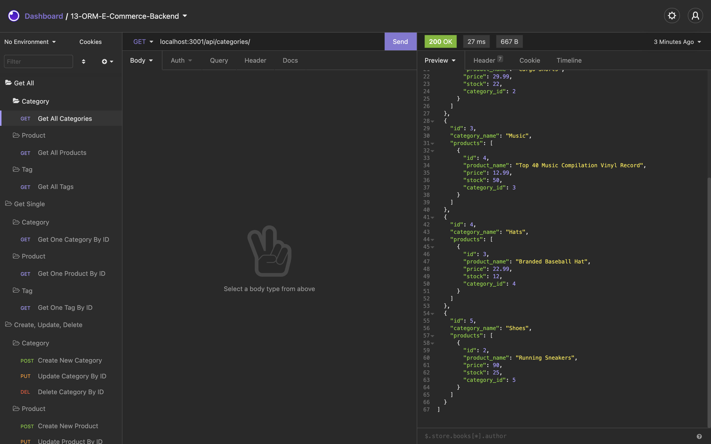
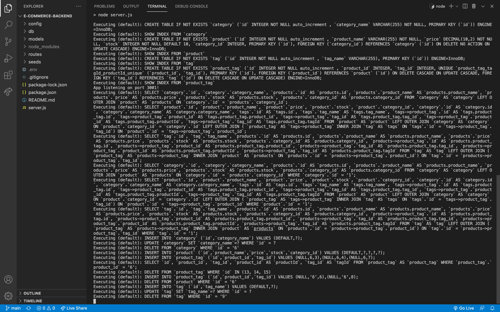

# E-Commerce Backend 

## Description
This app serves as the foundation of a simple E-Commerce backend. This app is built using express.js, mysql2 and sequelize.

## Table of Contents
- [Installation](#installation)
- [Usage](#usage)
- [Link](#link)
- [Contribute](#contribute)

- [Questions](#questions)

## Installation
THIS APP REQUIRES MYSQL INSTALLED. Run "npm i" to install all dependencies in the Integrated Terminal, then create the DB schema by running "source ./db/schema.sql" in MySQL shell. Once the DB schema is created, return to the Integrated Terminal and run "npm run seed" to seed the database. To start the app, run "npm start".

## Usage
This app serves as the foundation of a simple E-Commerce backend. Allow users to run a simple e-commerce site without start from scratch.

## Link:
[E-Commerce Backend Walkthorugh Video](https://drive.google.com/file/d/15QpNpx7fV19kup6EGUaaZfg9RPPz7OoC/view?usp=sharing)

## Contribute
If you wish to contribute, please feel free to contact me through my email in the Qeustions section.

## Questions
GitHub: [ywkuo227's GitHub](https://github.com/ywkuo227)

Email: [ywkuo@outlook.com](mailto:ywkuo@outlook.com)